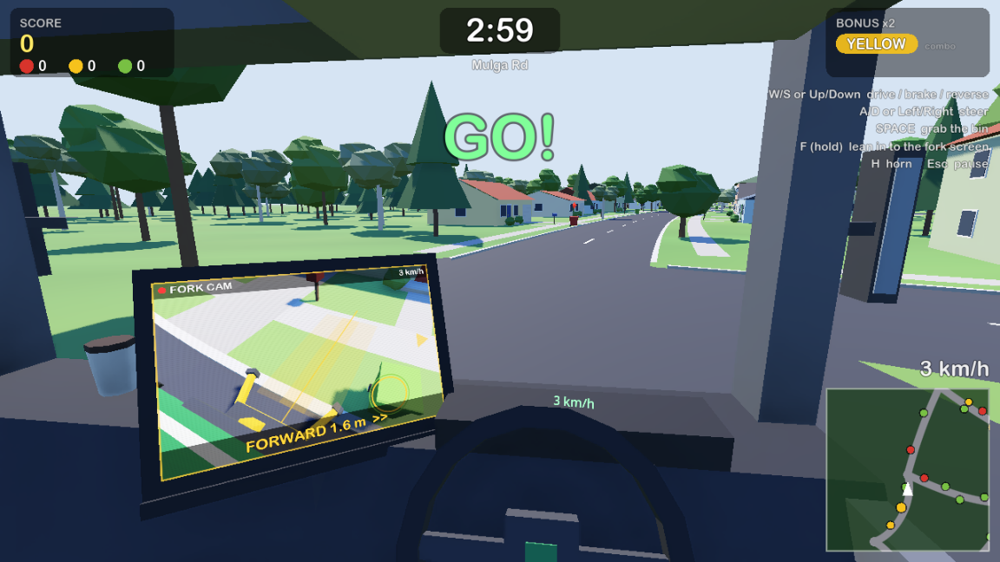
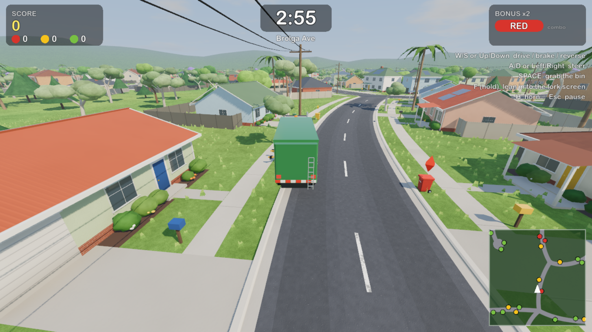
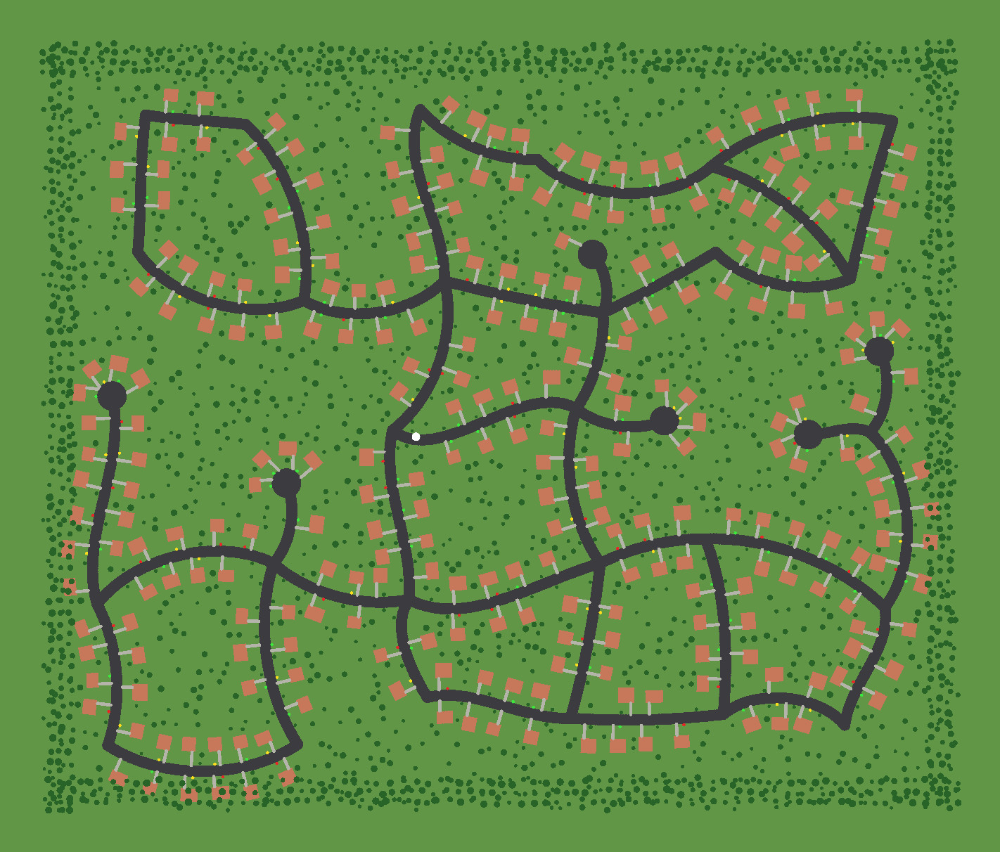

# Bin Day — a garbage truck simulator

Drive a side-loader garbage truck around a procedurally generated suburb and
empty as many wheelie bins as you can before the end of your shift.

The arm is on the truck's left flank, out of sight of the driver's seat. The
only way to see it is the **fork cam** screen next to the steering wheel:
creep along the kerb until the screen says **LINED UP**, then press
**Space** to grab, lift and tip the bin.





Written in Go on the [Godot Engine](https://godotengine.org/), using the
[graphics.gd](https://github.com/quaadgras/graphics.gd) bindings. Everything
(suburb, houses, trees, truck, sounds) is generated in code; there are no
art or audio assets.

## Running (macOS)

You need Go 1.27+ and Xcode command line tools (for cgo). The `gd` command
downloads the matching Godot build on first use.

```sh
go install graphics.gd/cmd/gd@latest
gd run
```

To export a standalone `.app`, use `GOOS=macos gd build`.

Options go after `--` when launching Godot directly, for example
`~/gd/bin/Godot.app/Contents/MacOS/Godot --path graphics -- --time=300 --seed=7`:

| Option | Meaning |
| --- | --- |
| `--time=SECONDS` | shift length (also selectable on the title screen) |
| `--seed=N` | which suburb to generate (with `--map`, where the houses go) |
| `--map=FILE` | play on real streets saved by the map maker |
| `--play` | skip the title screen |
| `--quality=high\|low` | graphics quality (also G on the title screen; remembered) |

## Real streets

The map maker builds a suburb on real streets from
[OpenStreetMap](https://www.openstreetmap.org/): pick an area, and the game
lays its houses, bins and trees out along those streets. It needs no account
or API key.

```sh
go run ./cmd/mapmaker
```

then open <http://localhost:8765/>, search for a place, drag the box over the
streets you want (150 m to 2 km across) and press **Preview** to see what the
game will build. **Save** writes the map to `maps/` and shows the command to
play it, for example:

```sh
~/gd/bin/Godot.app/Contents/MacOS/Godot --path graphics -- --map="$PWD/maps/malvern-east.json"
```

Only residential streets are used unless you tick **Include main roads**,
which helps when neighbourhoods are only joined by a main road. Divided roads
keep one carriageway, small roundabouts become plain junctions, and streets
that cross the edge of the box end in a turning circle. Streets that don't
join up with the rest are left out, since the truck can't reach them.

Without the web page, give the area as south,west,north,east:

```sh
go run ./cmd/mapmaker -bbox=-37.883,145.055,-37.876,145.066 -name="Malvern East"
```

Map data © OpenStreetMap contributors, under the
[Open Database Licence](https://www.openstreetmap.org/copyright). The game
shows this credit on the title screen when playing an imported map.

## How to play

| Key | Action |
| --- | --- |
| W / ↑ | accelerate |
| S / ↓ | brake, then reverse (listen for the beeper) |
| A D / ← → | steer |
| Space (or E) | grab the bin |
| F or Tab (hold) | lean in to look at the fork cam screen |
| R | change view: cab, chase or kerb (remembered) |
| H | horn |
| Esc / P | pause (Q from the pause screen ends the shift) |

On the title screen, ←/→ change the shift length, N builds a new suburb,
G switches graphics quality between HIGH and LOW, Enter starts and Esc quits.

- Traffic keeps left, so bins are on your **left**. Drive in the left lane
  and the bins will be within the arm's reach.
- Prefer to watch the fork from outside? R cycles between the driver's seat,
  a **chase** view behind the truck's left flank, and a **kerb** view from
  above the pickup zone. Outside the cab, the fork cam screen moves to the
  bottom-left corner.
- The fork cam shows the pickup zone on the kerb and tells you how far to go:
  `FORWARD 1.6 m >>`, `LINED UP!`, `PERFECT!`. "Ahead" is to the right of
  the screen, as if you were looking out of the left window.
- You don't need to stop dead: below about 10 km/h the truck pulls up by
  itself when you press Space.
- **Scoring:** 100 points per bin, +50 for a PERFECT line-up, double points
  for the current **bonus colour** (it changes every 40 seconds), and a
  combo multiplier of up to x3 if you keep emptying bins within 20 seconds
  of each other.
- Bins come in four colours: red (rubbish), yellow (recycling), green
  (garden) and blue (paper and cardboard). Floating markers show uncollected bins, and the minimap shows
  those nearby.
- Not every resident is tidy. Some bins are **overflowing** (+50 points, but
  they're heavier and more likely to slip out of the jaws), and some are left
  somewhere awkward: in the gutter where you might clip them, at the back of
  the footpath where you'll have to hug the kerb, or out in the middle of the
  street.
- **Bins fall over.** Drive into one at more than a crawl, or press Space
  when the fork isn't lined up and the jaws clip it, and over it goes. A
  full bin that falls over spills everywhere and is lost (-50, and your combo
  is gone). Now and then a bin slips out of the jaws on the way up (-50), or
  topples when it's put back down (-20, more likely if you weren't lined up
  PERFECT). An empty bin you knock over also costs 20.

Best scores are saved per shift length.

## Code layout

| Path | What |
| --- | --- |
| `internal/sim` | engine-independent game logic: suburb generator, truck physics, arm, scoring |
| `internal/osm` | turns OpenStreetMap street data into a street layout for the suburb builder |
| `internal/meshgen` | low-poly, vertex-coloured geometry for the town, truck and bins |
| `*.go` (root) | the Godot presentation layer: scene setup, cameras, HUD, fork cam overlay, audio synthesis |
| `shader.go` | the surface and sky shaders |
| `cmd/townmap` | renders a suburb layout to PNG (`go run ./cmd/townmap -seed 42 -o town.png`, or `-map FILE` for a saved map) |
| `cmd/mapmaker` | picks real streets to play on, in the browser or from the command line |
| `cmd/sheet` | tiles captured frames into a contact sheet |
| `scripts/capture.sh` | builds and records frames with Godot's movie writer |

### Graphics

Every surface uses one shader (`shader.go`). Meshes carry a material ID per
vertex (asphalt, grass, brick, weatherboard, roof tiles, corrugated steel,
glass, foliage, paint and so on), and the shader adds procedural,
world-space detail with bump mapping, so there are no textures. Foliage and
grass sway in the wind. Grass tufts are instanced per 40 m chunk and fade out
with distance. The sky shader draws the sun and clouds.

HIGH quality adds screen-space indirect light, glow, soft contact-hardening
shadows, 8K shadow maps, 4x MSAA and grass. LOW keeps SSAO and shadows but
drops those. On an M5 Pro at 1080p, HIGH runs at about 88 fps and LOW at
about 117 fps.

The logic packages have ordinary Go tests: `go test ./internal/...`.

For headless-ish checks, `scripts/capture.sh FRAMES [game options]` records
PNG frames to `/tmp/gts-capture`. It accepts these extra development options:

- `--scenario=pickup`: the truck starts short of a bin, then creeps up and grabs it.
- `--scenario=drive`: holds the throttle.
- `--scenario=drop`: like `pickup`, at an overflowing bin that is sure to slip out of the jaws.
- `--scenario=crash`: drives along the nature strip into a bin.
- `--synth-keys`: replays a key sequence through Godot's input system (menu, driving, pickup, pause, new suburb).
- `--view=cab|chase|kerb|top|fork`: starts in one of the driving views (without saving it), shows the scene from high above, or shows the fork cam full screen.


